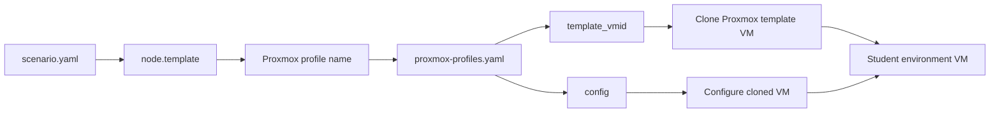
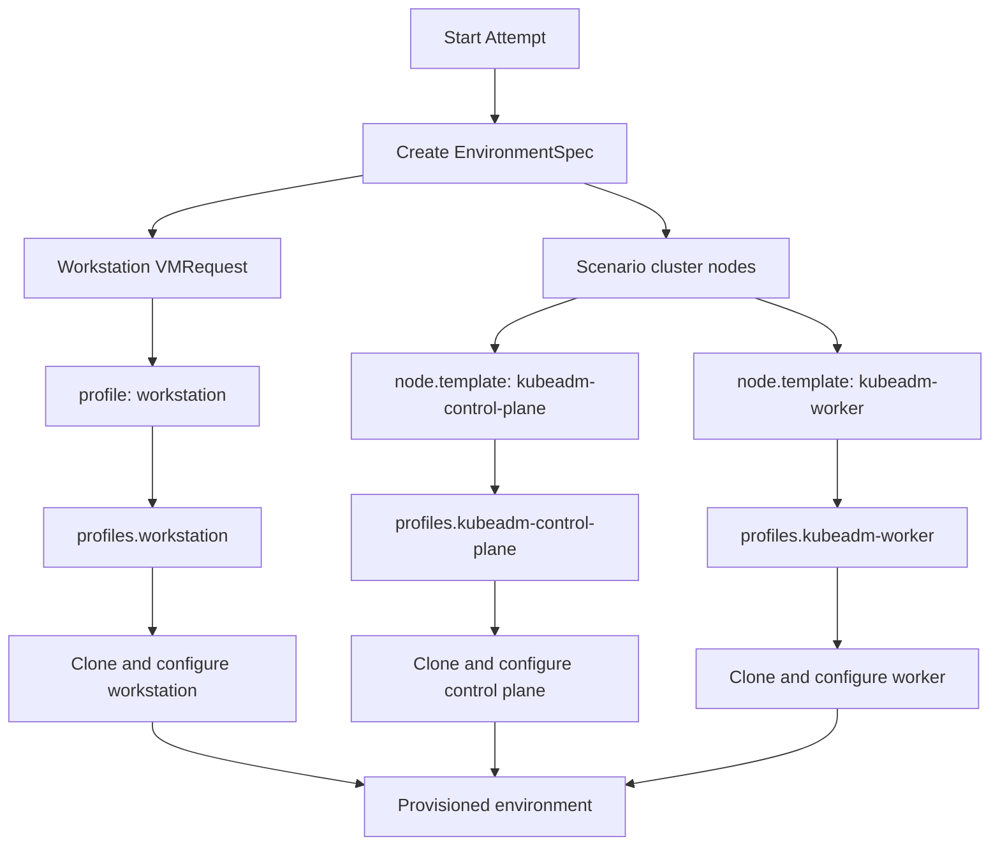

# Proxmox Setup

Painkiller Shell uses Proxmox VE as its infrastructure provider for creating and managing student environments. This guide covers Proxmox configuration, API token creation, and VM template requirements.

## Prerequisites

- Proxmox VE 7.0 or later
- Administrative access to Proxmox
- Sufficient resources (CPU, RAM, storage) for student environments
- Network configuration for VLAN/SDN isolation

## API Token Creation

Painkiller Shell authenticates to Proxmox using API tokens. Create a dedicated token for the application.

### Via Proxmox Web UI

1. Log in to Proxmox Web UI
2. Navigate to **Datacenter** → **Permissions** → **API Tokens**
3. Click **Add**
4. Configure the token:
   - **User**: Select or create a dedicated user (e.g., `painkiller@pam`)
   - **Token ID**: Enter a name (e.g., `api`)
   - **Comment**: Optional description
   - **Expire**: Leave blank for no expiration (or set a future date)
   - **Privilege Separation**: Unchecked (recommended for simplicity)
5. Click **Add**
6. **Copy the token secret** - it will not be shown again

The token ID format is: `user@realm!tokenname` (e.g., `painkiller@pam!api`)

### Via Command Line

```bash
# Create user (if needed)
pveum user add painkiller@pam --comment "Painkiller Shell API User"

# Create API token
pveum user token add painkiller@pam api --comment "Painkiller Shell API"

# Output includes token ID and secret
```

### Required Permissions

Grant the token necessary permissions:

```bash
# Grant permissions to the user when token privilege separation is disabled
pveum aclmod / -user painkiller@pam -role PVEVMAdmin
pveum aclmod /storage/local -user painkiller@pam -role PVEDatastoreUser
pveum aclmod /nodes/pve1 -user painkiller@pam -role PVEVMAdmin

# Grant SDN network use if the selected bridge/VNet is managed by Proxmox SDN
pveum role add PainkillerSDNUse -privs SDN.Use
pveum aclmod /sdn/zones/localnetwork/vmbr0 -user painkiller@pam -role PainkillerSDNUse

# Or grant full admin (less secure, easier setup)
pveum aclmod / -user painkiller@pam -role Administrator
```

If the API token has **Privilege Separation** enabled, grant permissions to the token instead of only the user:

```bash
pveum aclmod /vms/9010 -token 'painkiller@pam!api' -role PVEVMAdmin
pveum aclmod /storage/local-lvm -token 'painkiller@pam!api' -role PVEDatastoreUser
pveum aclmod /sdn/zones/localnetwork/vmbr0 -token 'painkiller@pam!api' -role PainkillerSDNUse
```

Use the template VMIDs from `PROXMOX_PROFILES_FILE` for `/vms/9010`, use the configured `PROXMOX_STORAGE_POOL` for `/storage/local-lvm`, and use the configured Proxmox SDN zone and `PROXMOX_NETWORK_BRIDGE` for `/sdn/zones/localnetwork/vmbr0`.

Required permissions:
- `VM.Allocate` - Create VMs
- `VM.Clone` - Clone VMs from templates
- `VM.Config.*` - Configure VM settings
- `VM.PowerMgmt` - Start/stop VMs
- `VM.Console` - Access VM console (for debugging)
- `Datastore.AllocateSpace` - Use storage for VM disks
- `Sys.Audit` - Read node and VM information
- `SDN.Use` - Use a Proxmox SDN bridge or VNet when the VM NIC is attached to SDN-managed networking

## Configuration

Add Proxmox credentials to `.env`:

```bash
PROXMOX_URL=https://proxmox.example.com:8006
PROXMOX_TOKEN_ID=painkiller@pam!api
PROXMOX_TOKEN_SECRET=<secret-from-token-creation>
PROXMOX_NODE=pve1
```

### Configuration Reference

**`PROXMOX_URL`**
- Proxmox API endpoint
- Must be HTTPS
- Include port (default 8006)

**`PROXMOX_TOKEN_ID`**
- Format: `user@realm!tokenname`
- Example: `painkiller@pam!api`

**`PROXMOX_TOKEN_SECRET`**
- Secret from token creation
- Keep secure, never commit to Git

**`PROXMOX_NODE`**
- Proxmox node name where VMs are created
- Get from Proxmox UI: **Datacenter** → **Nodes**
- Example: `pve1`

**`PROXMOX_SKIP_TLS_VERIFY`** (optional)
- Set to `true` to skip TLS certificate verification
- Use for self-signed certificates in development/test environments
- Default: `false`

## VM Templates

Painkiller Shell clones VMs from pre-built templates. Create templates for each node type.

### Required Templates

**`kubeadm-control-plane`**
- Base image for Kubernetes control plane nodes
- Includes: kubeadm, kubelet, kubectl, container runtime

**`kubeadm-worker`**
- Base image for Kubernetes worker nodes
- Includes: kubeadm, kubelet, container runtime

**`workstation`**
- Student workstation VM
- Includes: kubectl, SSH server, base tools

### Template Requirements

All templates must include:

1. **cloud-init** - For VM customization on first boot
2. **cloud-init drive** - A cloud-init CDROM drive must be attached to the template (e.g., `ide0: cloudinit`). Painkiller Shell applies Proxmox VM config from clone profiles, typically `citype`, `ipconfig0`, and `sshkeys`.
3. **SSH server** - For remote management
4. **Base packages** - Common utilities (curl, wget, vim, etc.)
5. **QEMU guest agent** - For Proxmox integration (required for IP address retrieval)

### Building Templates

#### Option 1: Manual Creation

1. Create a new VM in Proxmox
2. Install Ubuntu 22.04 LTS (or your preferred OS)
3. Install required packages:

```bash
# Update system
apt-get update && apt-get upgrade -y

# Install base tools
apt-get install -y curl wget vim git jq

# Install cloud-init
apt-get install -y cloud-init

# Install QEMU guest agent
apt-get install -y qemu-guest-agent
systemctl enable qemu-guest-agent

# Install container runtime (containerd)
apt-get install -y containerd
mkdir -p /etc/containerd
containerd config default > /etc/containerd/config.toml
systemctl restart containerd

# Install kubeadm, kubelet, kubectl
curl -fsSL https://pkgs.k8s.io/core:/stable:/v1.29/deb/Release.key | gpg --dearmor -o /etc/apt/keyrings/kubernetes-apt-keyring.gpg
echo 'deb [signed-by=/etc/apt/keyrings/kubernetes-apt-keyring.gpg] https://pkgs.k8s.io/core:/stable:/v1.29/deb/ /' > /etc/apt/sources.list.d/kubernetes.list
apt-get update
apt-get install -y kubelet kubeadm kubectl
apt-mark hold kubelet kubeadm kubectl

# Enable kubelet
systemctl enable kubelet

# Clean up
apt-get clean
rm -rf /var/lib/apt/lists/*
```

4. Configure cloud-init:

```bash
# Enable cloud-init
systemctl enable cloud-init

# Clean cloud-init state
cloud-init clean --logs
```

5. Shut down the VM
6. Convert to template: Right-click VM → **Convert to Template**

#### Option 2: Packer Automation

Use [HashiCorp Packer](https://www.packer.io/) to automate template creation.

Example `packer/template.pkr.hcl`:

```hcl
packer {
  required_plugins {
    proxmox = {
      version = ">= 1.1.0"
      source  = "github.com/hashicorp/proxmox"
    }
  }
}

source "proxmox-iso" "kubeadm-control-plane" {
  proxmox_url              = "https://proxmox.example.com:8006/api2/json"
  username                 = "root@pam"
  password                 = var.proxmox_password
  node                     = "pve1"
  
  vm_name                  = "kubeadm-control-plane-template"
  template_description     = "Kubernetes control plane node template"
  
  iso_file                 = "local:iso/ubuntu-22.04.3-live-server-amd64.iso"
  
  cores                    = 2
  memory                   = 4096
  disks {
    disk_size              = "20G"
    storage_pool           = "local-lvm"
    type                   = "scsi"
  }
  network_adapters {
    bridge                 = "vmbr0"
    model                  = "virtio"
  }
  
  ssh_username             = "ubuntu"
  ssh_password             = "ubuntu"
  ssh_timeout              = "20m"
  
  boot_command = [
    "<esc><wait>",
    "autoinstall ds=nocloud-net;s=http://{{ .HTTPIP }}:{{ .HTTPPort }}/ ",
    "<enter>"
  ]
  
  http_directory           = "http"
}

build {
  sources = ["source.proxmox-iso.kubeadm-control-plane"]
  
  provisioner "shell" {
    scripts = [
      "scripts/base-packages.sh",
      "scripts/containerd.sh",
      "scripts/kubernetes.sh",
      "scripts/cloud-init.sh",
      "scripts/cleanup.sh"
    ]
  }
}
```

Build template:

```bash
packer build template.pkr.hcl
```

### Clone Profile Configuration

Configure Proxmox clone profiles in the file referenced by `PROXMOX_PROFILES_FILE`:

```bash
PROXMOX_PROFILES_FILE=/etc/painkiller/proxmox-profiles.yaml
```

Each profile maps a logical scenario/template name to the Proxmox template VMID to clone and the VM config to apply after clone:

```yaml
profiles:
  workstation:
    template_vmid: 900
    clone_mode: linked
    config:
      citype: nocloud
      ipconfig0: ip=dhcp
      sshkeys: "{{ ssh_public_key }}"

  kubeadm-control-plane:
    template_vmid: 901
    clone_mode: linked
    config:
      citype: nocloud
      ipconfig0: ip=dhcp
      sshkeys: "{{ ssh_public_key }}"

  kubeadm-worker:
    template_vmid: 902
    clone_mode: full
    config:
      citype: nocloud
      ipconfig0: ip=dhcp
      sshkeys: "{{ ssh_public_key }}"
```

Get template VMIDs from Proxmox UI or CLI:

```bash
qm list | grep template
```

The `clone_mode` field controls how Proxmox clones the template:

- **`linked`** (default) - Creates a linked clone that shares the base disk with the template. Faster and uses less storage, but requires the template to remain available.
- **`full`** - Creates a full independent copy of the template disk. Slower and uses more storage, but the clone is completely independent.

The profile names are important. Cluster nodes in `scenario.yaml` reference these names through their `template` field. The `workstation` profile is not written in `scenario.yaml`; Painkiller creates a workstation VM for every attempt and always resolves it through `profiles.workstation`.



For example, this scenario node:

```yaml
topology:
  clusters:
    - id: cluster-a
      nodes:
        - name: cp-1
          role: control-plane
          template: kubeadm-control-plane
```

Resolves like this:

```text
template: kubeadm-control-plane
        -> profiles.kubeadm-control-plane
        -> clone Proxmox template VMID 901
        -> apply profile config
        -> VM becomes cluster-a-cp-1
```

The full environment resolution is:



## Network Configuration

Student environments require network isolation to prevent interference between students.

### VLAN-Based Isolation

Configure VLANs in Proxmox:

1. Enable VLAN support on your network switch
2. Configure Proxmox bridge to support VLANs:

```bash
# Edit /etc/network/interfaces
auto vmbr0
iface vmbr0 inet static
    address 10.0.0.1/24
    gateway 10.0.0.1
    bridge-ports eth0
    bridge-stp off
    bridge-fd 0
    bridge-vlan-aware yes
    bridge-vids 2-4094
```

3. Restart networking:

```bash
systemctl restart networking
```

### SDN (Software-Defined Networking)

For Proxmox 8+, use SDN for more flexible networking:

1. Enable SDN in Proxmox: **Datacenter** → **SDN**
2. Create a zone for student networks
3. Create VNets for each student environment
4. Configure IPAM for automatic IP assignment

### Network Profiles

Define network profiles in the application. Each profile maps to a VLAN or VNet:

```go
type NetworkProfile struct {
  Name     string
  VLANID   int
  Bridge   string
  CIDR     string
  Gateway  string
}
```

Example profiles:

```go
NetworkProfiles: map[string]NetworkProfile{
  "student-net": {
    Name:    "student-net",
    VLANID:  100,
    Bridge:  "vmbr0",
    CIDR:    "10.100.0.0/24",
    Gateway: "10.100.0.1",
  },
}
```

## Storage Configuration

Ensure sufficient storage for VM templates and student environments.

### Recommended Storage

- **Templates**: Fast SSD storage (local-lvm, Ceph, NFS)
- **Student VMs**: Fast SSD storage for performance
- **Backups**: Separate storage for VM backups

### Storage Quotas

Monitor storage usage:

```bash
# Check storage usage
pvesm status

# Check specific storage
pvesm status --storage local-lvm
```

Set up alerts for low storage:

```bash
# Example: alert if storage > 80% full
USAGE=$(pvesm status --storage local-lvm --output usage | tail -n 1)
if [ "$USAGE" -gt 80 ]; then
  echo "Warning: storage usage is $USAGE%"
fi
```

## Cloud-Init Configuration

Painkiller Shell uses Proxmox's built-in cloud-init parameters to customize VMs on first boot. This requires templates to have a cloud-init drive attached (e.g., `ide0: cloudinit`).

The profile file controls the Proxmox VM config sent to `/nodes/{node}/qemu/{vmid}/config`. Common cloud-init parameters are:

- **`citype`** - Cloud-init type, usually `nocloud` for Linux guests
- **`sshkeys`** - SSH public key for the ephemeral session; use `{{ ssh_public_key }}` to inject Painkiller's per-attempt key
- **`ipconfig0`** - Cloud-init network configuration, for example `ip=dhcp`

Painkiller supports these profile placeholders:

- `{{ ssh_public_key }}` - The per-attempt SSH public key generated by Painkiller
- `{{ hostname }}` - The VM hostname Painkiller passes to the clone operation

Painkiller fails fast during startup for known-bad legacy config:

- `cipublickey` is rejected; use `sshkeys` instead
- `ciname` is rejected; the VM name/hostname is set during clone
- `ipconfig0` values containing `bridge=` are rejected; bridge or VNet attachment belongs in the template NIC or a `net0` VM config value, not in `ipconfig0`

### Attaching a Cloud-Init Drive to a Template

```bash
# Add a cloud-init CDROM drive to template VMID 900
qm set 900 --ide0 local-lvm:cloudinit
```

Or via the Proxmox UI: select the template → **Hardware** → **Add** → **CloudInit Drive**.

### Scenario-Specific Customization

For scenario-specific setup beyond cloud-init, use Ansible playbooks in the scenario's `provision/` directory.

## Monitoring and Maintenance

### Proxmox Health

Monitor Proxmox cluster health:

```bash
# Check node status
pvecm status

# Check cluster resources
pvesh get /cluster/resources
```

### VM Cleanup

Orphaned VMs can accumulate. Run the cleanup reconciler regularly:

```bash
# List all VMs
qm list

# Find VMs with Painkiller tags
qm list | grep painkiller

# Manual cleanup (if needed)
qm destroy <vmid> --purge
```

### Template Updates

Update templates periodically with security patches:

1. Clone the template to a regular VM
2. Update packages: `apt-get update && apt-get upgrade`
3. Shut down and convert back to template
4. Update template VMID in application config
5. Test with a new scenario

## Troubleshooting

### API Connection Failed

Verify Proxmox URL and credentials:

```bash
curl -k https://proxmox.example.com:8006/api2/json/access/ticket \
  -d "username=painkiller@pam&password=secret"
```

### Permission Denied

Check token permissions:

```bash
pveum user token list painkiller@pam
pveum acl list | grep painkiller
```

If a start attempt fails with `Permission check failed (/vms/<vmid>, VM.Clone)` and the token has privilege separation enabled, grant permissions directly to the token:

```bash
pveum aclmod /vms/9010 -token 'painkiller@pam!api' -role PVEVMAdmin
pveum aclmod /storage/local-lvm -token 'painkiller@pam!api' -role PVEDatastoreUser
```

Replace `9010` with the workstation template VMID and `local-lvm` with `PROXMOX_STORAGE_POOL`.

### Template Not Found

Verify template exists and is accessible:

```bash
qm list | grep 9001
pvesh get /nodes/pve1/qemu/9001/config
```

### VM Creation Failed

Check Proxmox logs:

```bash
journalctl -u pvedaemon
journalctl -u pveproxy
```

### Network Issues

Verify VLAN configuration:

```bash
# Check bridge VLANs
bridge vlan show

# Check VM network config
qm config <vmid> | grep net
```

## Best Practices

1. **Dedicated user** - Create a dedicated Proxmox user for Painkiller Shell
2. **Minimal permissions** - Grant only required permissions to the API token
3. **Resource limits** - Set CPU and memory limits on student VMs
4. **Monitoring** - Monitor Proxmox resource usage and set up alerts
5. **Backups** - Regularly back up VM templates
6. **Documentation** - Document your Proxmox setup and network configuration
7. **Testing** - Test VM creation and destruction in a staging environment
8. **Cleanup** - Implement automated cleanup for orphaned VMs
9. **Security** - Use HTTPS for Proxmox API access
10. **Capacity planning** - Monitor resource usage and plan for scaling
